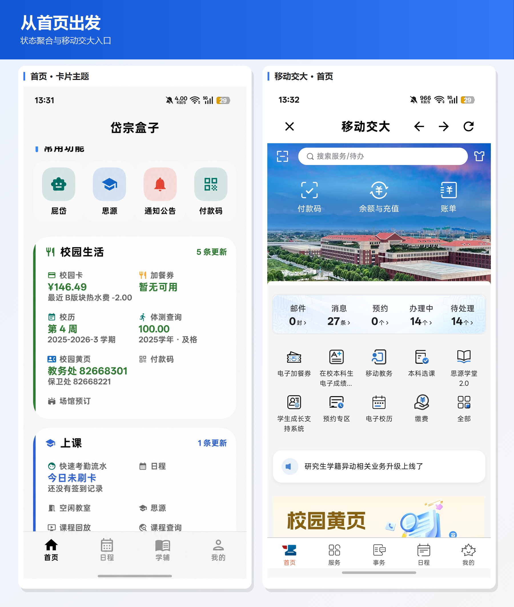
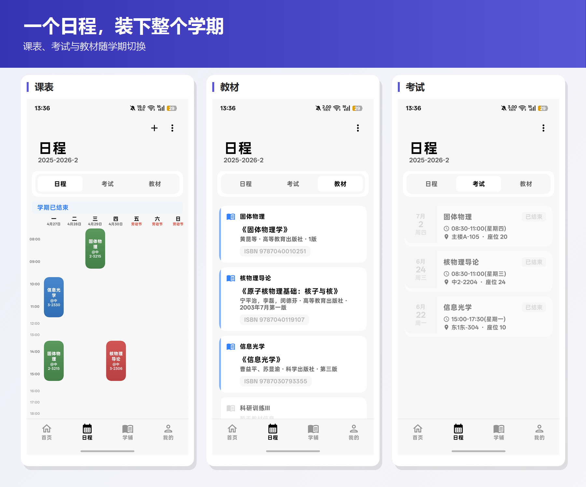
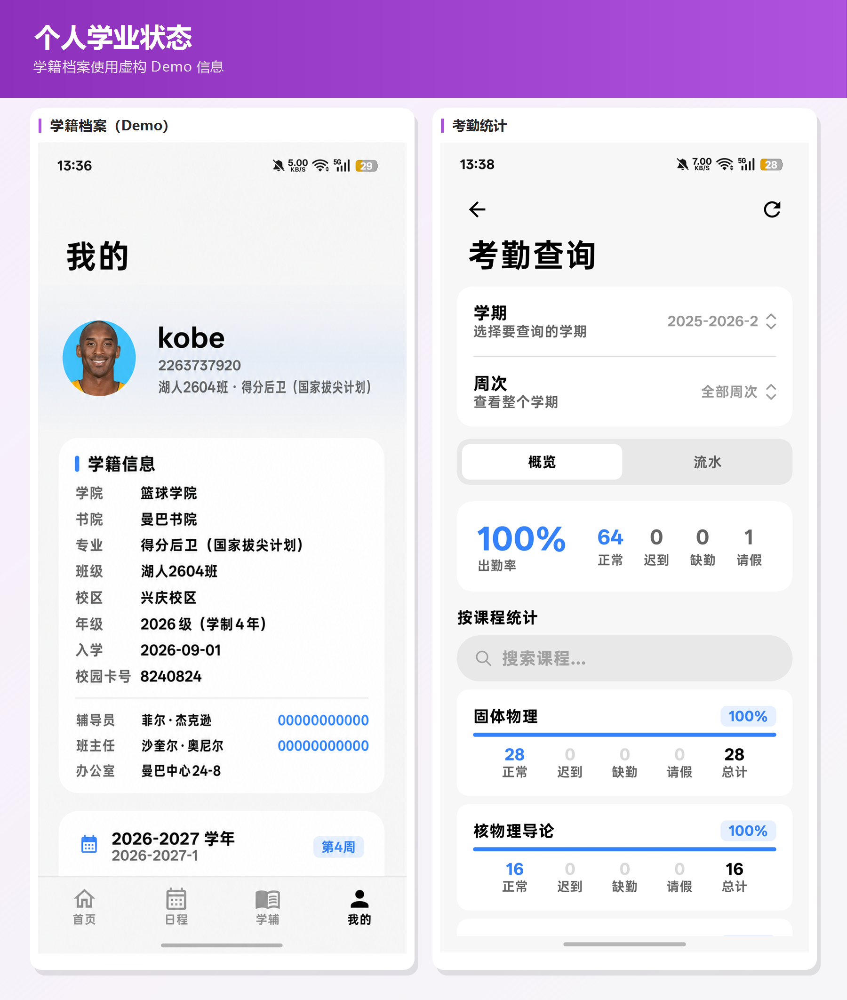
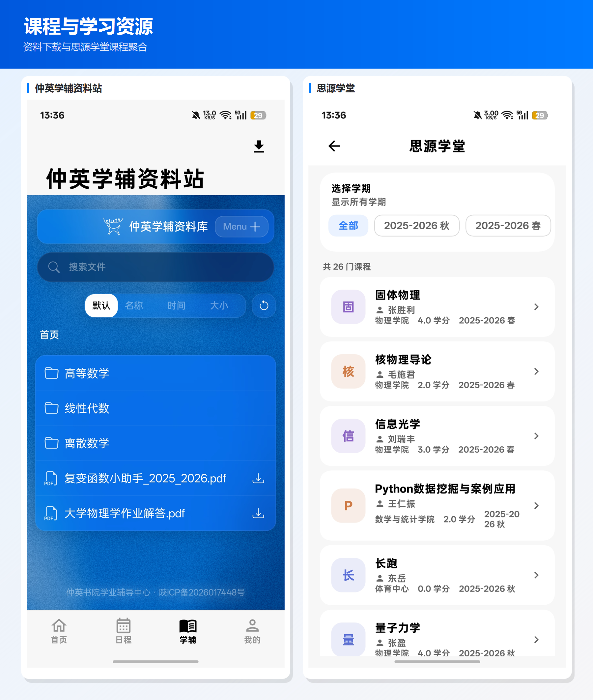
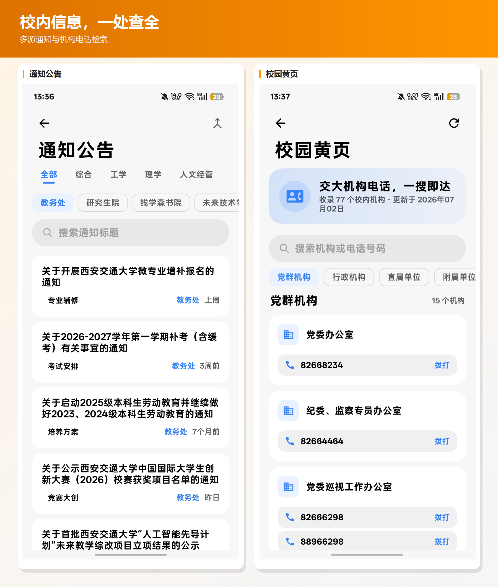
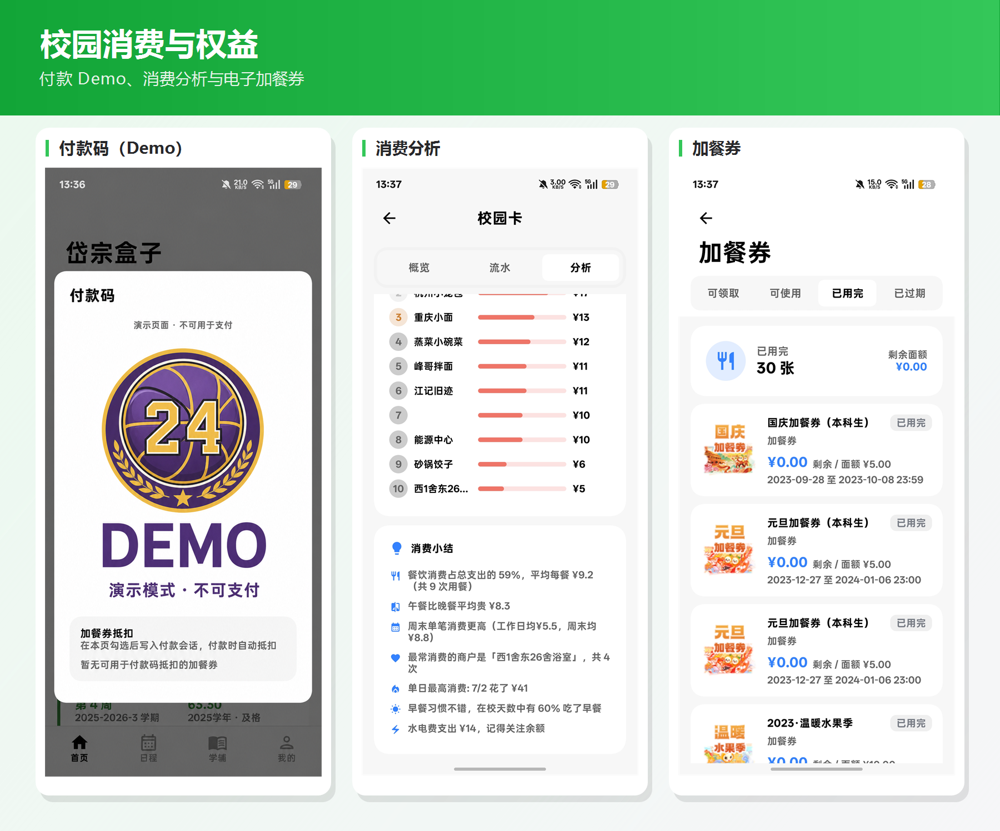
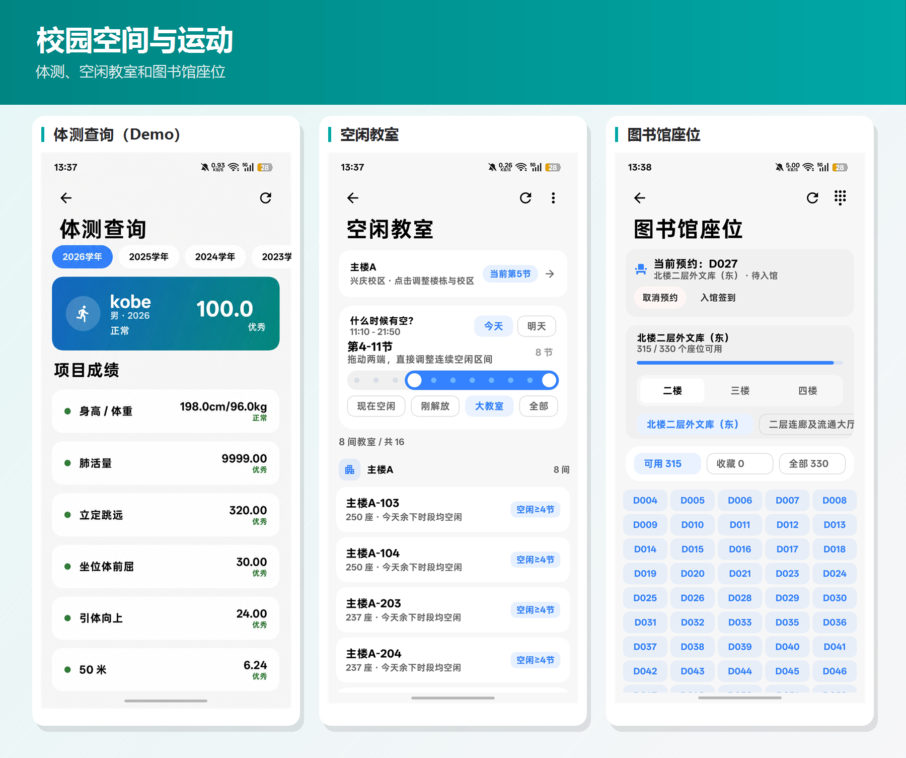
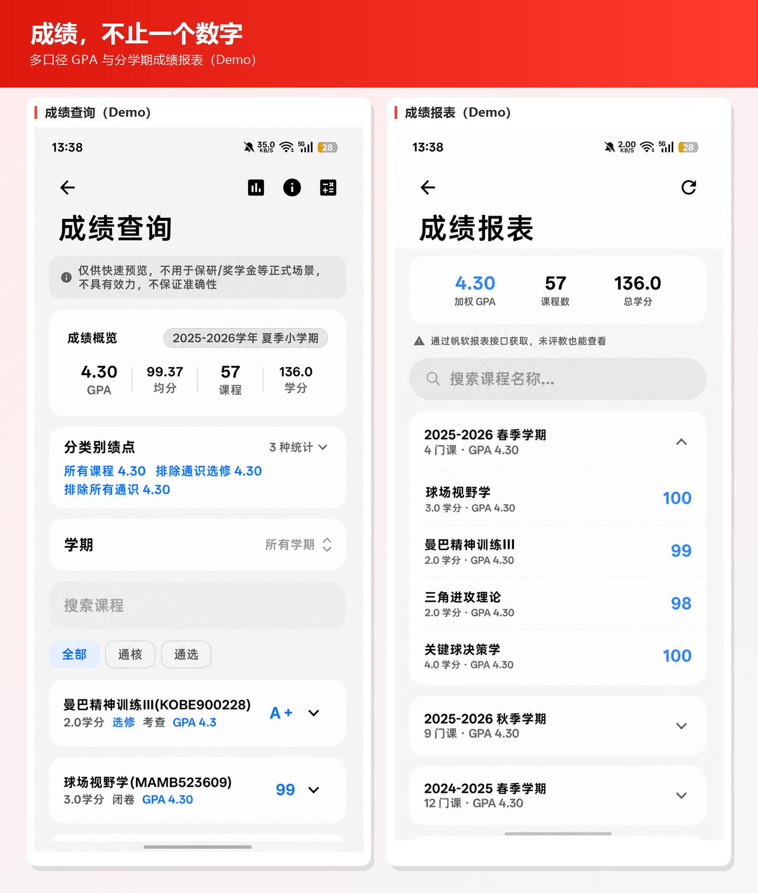
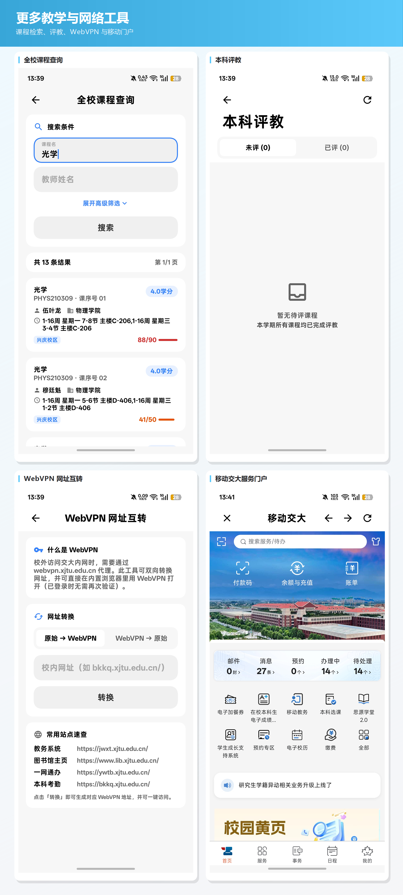
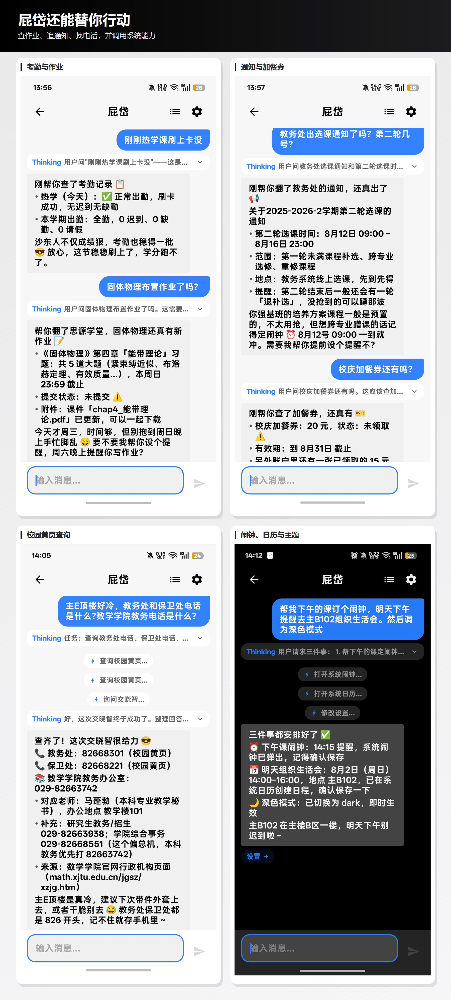

<h1 align="center">🌟✨⭐ 求 Star！！！⭐✨🌟</h1>

# 岱宗盒子

<p align="center">
  
  
  
  
</p>

面向西安交通大学学生的 Android 校园工具箱。项目使用 Kotlin 与 Jetpack Compose 原生开发，直接访问教务、图书馆、校园卡、思源学堂等学校系统，不依赖自建业务中转服务器。

应用内置可自定义名称的校园 AI 助手「**屁岱**」。配置兼容 OpenAI API 格式的模型服务后，它可以调用本地校园工具，查询课表、成绩、考试、空闲教室、校园卡、通知、思源学堂、体测等信息，并以自然语言和卡片形式回答；也可调用学校的「交晓智」补充校内政策与办事知识。

> AI 对话可能包含个人校园数据。请使用可信的模型服务并妥善保管 API Key。

---

## 4.5 亮点

| 能力 | 说明 |
|------|------|
| 🏠 双首页主题 | 图标主题以分类宫格展示全部能力；卡片主题聚合下节课、校园卡余额、本周出勤率、待评教、体测、作业等实时状态 |
| 🔔 主动提醒 | 屁岱可提醒余额不足、新成绩、临近上课和教务处新通知，并支持在设置中关闭 |
| 🎓 学籍档案 | 「我的」页展示证件照、书院、学院、专业、班级、校区，以及辅导员和班主任联系方式 |
| 📥 下载管理 | 仲英学辅资料站支持文件下载；思源课件、课程回放、成绩单和资料站文件统一管理，支持多选删除 |
| 👥 多账号 | 支持添加、切换、改密和删除账号，各账号的课表、成绩、对话、校园卡数据相互隔离 |
| 📱 校外访问 | 修复移动交大 WebVPN 访问链路，网页内可调用相机；统一认证支持 MFA 与失败退避 |

---

## 界面预览

下面用 11 组、30 个真实界面串起岱宗盒子的主要使用场景：从一天的课程安排，到成绩、校园卡、图书馆，再到能实际调用这些能力的校园助手。

> 为保护隐私，身份、成绩、体测和付款码等页面均已替换为虚构 Demo 数据；示例姓名、照片、学号、课程和数值不对应任何真实学生，付款码也不是有效凭证。

### 从首页出发

图标主题把常用能力收进一张清晰的功能地图；移动交大则直接嵌入应用，校内服务不必在多个入口之间来回切换。



### 一个日程，装下整个学期

课表、教材与考试安排集中展示。既能快速确认下一节课，也能查看课程细节、考试时间与地点。



### 学籍与考勤，一眼有数

个人档案聚合基础学籍信息，考勤记录则按日期呈现出勤流水，让分散在不同系统里的信息回到同一个页面。



### 学习资料，随用随取

电子教材和仲英学辅资料站覆盖教材阅读、资料检索与文件下载，减少在网页和文件夹之间反复寻找的成本。



### 通知与黄页，不再靠翻群聊

校园通知集中浏览，校园黄页快速检索常用联系方式。找消息和找人，都可以少走几步。



### 校园卡与加餐券

余额、消费流水、付款码和加餐券统一管理。高频校园支付场景被放进更短、更直接的操作路径。



### 空间与体测

空闲教室帮助临时自习，图书馆提供座位相关能力，体测页面则集中呈现项目成绩与总评。



### 成绩，不只是一串数字

成绩查询适合快速浏览，成绩报表则提供更完整的学期视图与统计信息。示例课程和分数均为虚构数据。



### 校园工具，也可以保持轻巧

从全校课程查询、评教到 WebVPN 与移动服务，岱宗盒子把那些“偶尔需要、需要时又很急”的入口放在手边。



### AI 也要懂校园语境

除了通用模型，应用还接入学校的交晓智，并支持思源学堂等校园知识与学习场景，让回答更贴近校内实际。


### 屁岱：不止陪聊，还能办事

屁岱可以把自然语言请求转成校园工具调用：查课表、看成绩、找通知、读考勤、搜黄页，也能继续调用系统能力完成下一步操作。



---

## 功能

| 模块 | 功能 |
|------|------|
| 🔐 账号与认证 | CAS 登录、MFA 手机验证码、多账号管理、WebVPN 自动切换、登录诊断与请求限流 |
| 📅 日程 | 多学期课表、考试安排、教材信息、自定义日程、桌面小组件、ICS / CSV / 图片导出 |
| 📊 成绩与学籍 | JWAPP 成绩、FineReport 成绩单、GPA 计算、个人学籍档案 |
| ✅ 考勤 | 本科生 / 研究生考勤查询、出勤统计与日期流水 |
| 🏫 教学空间 | 空闲教室 CDN / 直查、全校课程检索、体育场馆预订 |
| 💳 校园生活 | 校园卡余额与流水、付款码、加餐券查询 / 领取 / 抵扣 |
| 📚 图书馆 | 预约状态、空闲座位推荐、预约、换座、取消与签到 |
| 📖 思源学堂 | 课程、活动、作业、评分、课件与附件查看下载 |
| 🎓 课程回放 | TronClass 多机位视频播放、课件下载与统一下载管理 |
| 📥 仲英学辅 | 资料检索与文件下载 |
| 📢 校园信息 | 教务处 / 学院通知聚合、校园黄页、体测成绩、电子教材、移动交大 |
| 🧠 AI 助手 | 多会话、Markdown、流式回复、联网搜索、网页阅读、校园工具调用、系统闹钟 / 日历调用 |
| 🤝 交晓智 | 官方校园问答，支持独立多会话，也可作为屁岱的校内知识子代理 |
| ✏️ 评教 | GSTE 与常规评教 |

学校接口和开放范围可能随时变化，个别功能在校外需要校园 WebVPN、系统级 VPN 或校园网环境。

---

## 技术栈

- Kotlin、Jetpack Compose、MIUIX
- OkHttp、Brotli、Jsoup、Gson
- Room、KSP、Kotlin Coroutines
- Android Gradle Plugin 9、Gradle 9、JDK 21
- `minSdk 31`、`targetSdk 36`、`compileSdk 37`

MIUIX 通过 Gradle composite build 直接引用源码，依赖目录为仓库根目录下的 `miuix-ref`。

---

## 本地构建

### 环境要求

- Android Studio 或 Android SDK（需安装 API 37）
- JDK 21
- Git

### 获取源码与依赖

```bash
git clone https://github.com/yeliqin666/xjtu-toolbox-android.git
cd xjtu-toolbox-android
git clone --depth 1 https://github.com/miuix-kotlin-multiplatform/miuix.git miuix-ref
```

### 编译

```bash
# Windows
gradlew.bat assembleDebug

# macOS / Linux
./gradlew assembleDebug
```

Debug APK 位于 `app/build/outputs/apk/debug/`。

Release 构建会启用代码压缩与资源收缩。未提供签名配置时可生成未签名产物；如需签名，请通过 CI 环境变量 `KEYSTORE_PATH`、`STORE_PASSWORD`、`KEY_ALIAS`、`KEY_PASSWORD`，或在本地提供已被 Git 忽略的 `release.jks` 与 `keystore.properties`。

```bash
./gradlew assembleRelease
```

GitHub Actions 会在推送到 `main` 后使用签名密钥构建 Release APK，并根据 `versionName` 创建或更新对应的 GitHub / Gitee Release。发版前需先同步更新 `versionName`、`versionCode` 与 `AppChangelog.kt`。

---

## 使用须知

- 本项目仅供学习与个人校园信息管理使用，请遵守学校各系统的使用规则。
- 学校系统接口可能调整，功能可用性以实际情况为准。
- 请勿高频请求或尝试绕过验证码、访问控制等安全机制。
- API Key、账号凭据和下载的个人资料均应妥善保管。
- AI 生成内容与交晓智结果可能有误，重要信息请以学校官方渠道为准。

---

## 友情项目

- [XJTUToolBox](https://github.com/yan-xiaoo/XJTUToolBox.git)
- [XJTU-Course-Genius](https://github.com/Hz162/XJTU-Course-Genius)

---

**License**：MIT
